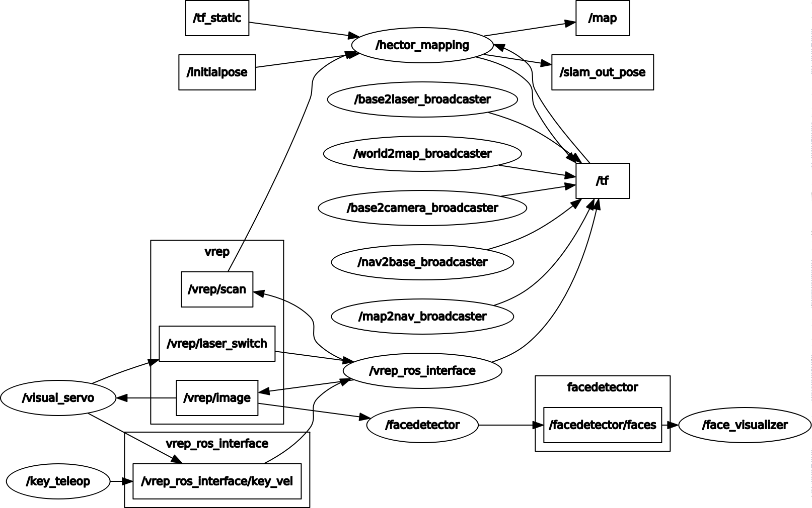
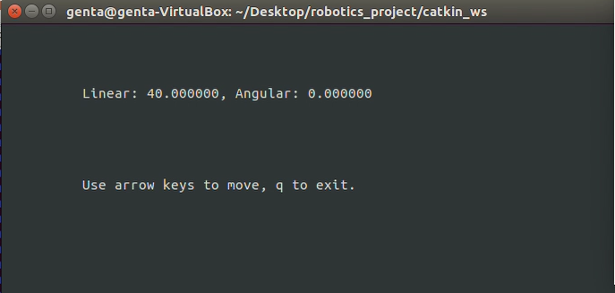
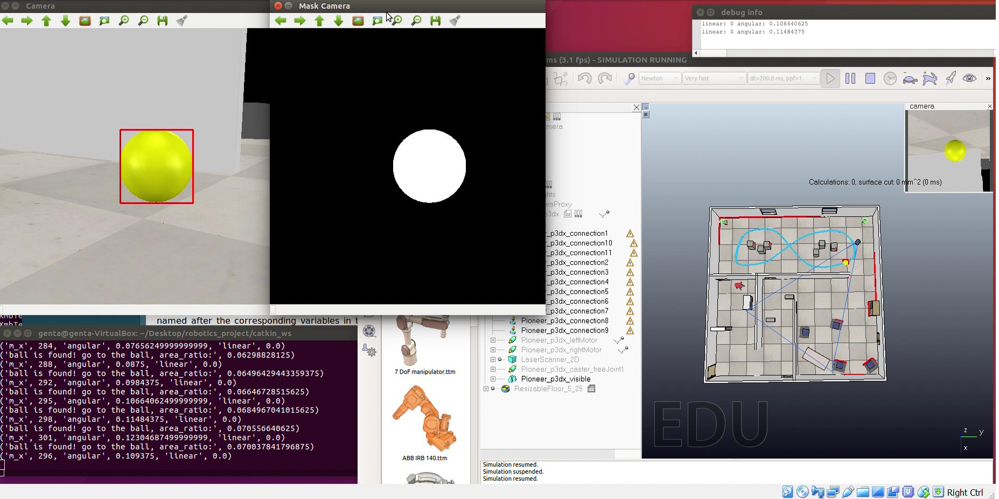
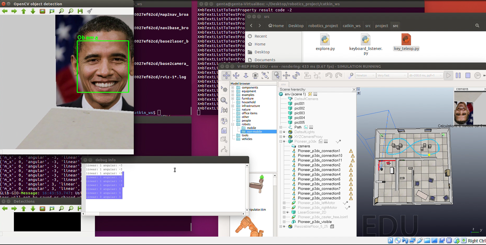

# ROS and V-REP for Robot Mapping and Localization
It is an implementation of robot mapping and localization using <a href="http://www.ros.org/">Robot Operating System (ROS)</a> and V-REP simulator. In this project, the robot can go around the unknown area and use laser sensor to generate the mapping. In addition, we have tasks such as visual servoing and face recognition using camera and OpenCV.

### Demo video
https://youtu.be/n-XK24o42Oo

### Setup
In this project, we use Ubuntu 16.04 LTS operating system. 

Our project requires several libraries and packages as follows:
- ROS kinetic full, see http://wiki.ros.org/kinetic/Installation/Ubuntu
- V-REP 3.5.0 EDU PRO, see http://www.coppeliarobotics.com/downloads.html
- OpenCV 3.3 for Python, C++
- Hector slam library
- g++ 5.5 or later (you may face some compilation issues with older versions)

### Additional Libraries
```
# install hector-slam
sudo apt install ros-kinetic-hector-slam
```

### Prepare Workspace:
```
# git clone this project
git clone https://github.com/gentaiscool/elec6910r-ros-project.git
# make sure you remove build and devel directories
rm -rf ./build ./devel

# install ROS kinetic from http://wiki.ros.org/kinetic/Installation/Ubuntu
# install V-REP 3.5.0 from http://www.coppeliarobotics.com/downloads.html
Prepare the workspace
# To prepare the workspace
echo "source /opt/ros/kinetic/setup.bash" >> ~/.bashrc
source ~/.bashrc
cd ./catkin_ws/
catkin_make
echo "source ./catkin_ws/devel/setup.bash" >> ~/.bashrc
source ~/.bashrc

# copy libv_repExtRosInterface to V-REP directory
cd catkin_ws/devel/lib
cp libv_repExtRosInterface.so  ~/V-REP

# double check if you have the following programs:
rviz
rqt_graph
```
### Run the project:
```
roscore

# Execute V-REP
./vrep.sh
# Open scene env.ttt in V-REP and start the simulation

# Load keyboard controller
rosrun project key_teleop.py

# Load the launcher 
roslaunch hector.launch

# Also check rqt_graph and rostopic list
```

### Features

#### Ros graph
Generated by rqt_graph



#### Keyboard control
Our code is based on key_teleop.py script. We changed the speed and the publisher node.



```
# Load keyboard controller
rosrun project key_teleop.py
```

#### Visual Servoing
In this task, the machine has to track and follow the yellow ball (#FFFF00). 



#### Face recognition
In this example, we detect President Obama's face.



#### Authors
- Genta Indra Winata (gentaindrawinata@gmail.com / giwinata@connect.ust.hk)
- Lin Zhaojiang (zlinao@connect.ust.hk)

#### Note
ELEC6910R - Robotic Perception and Learning Final Project in HKUST

#### Acknowledgement
- Prof. LIU Ming 
- TA: HUANG Kan
- We also thank Chien-Sheng Wu for the assistance

